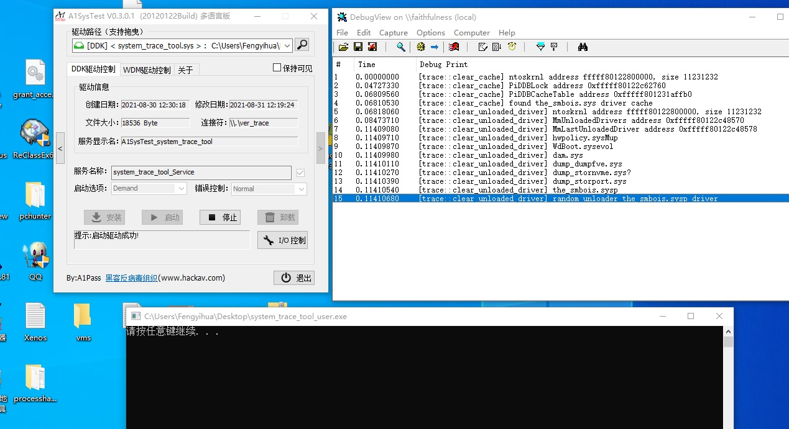

# system_trace_tool
内核驱动加载/卸载痕迹清理,努力绕过反作弊吧 PiDDBCacheTable and MmLastUnloadedDriver

## g_CiEaCacheLookasideList
## g_KernelHashBucketList
## g_HashCacheLock
## MmUnloadedDrivers
## MmLastUnloadedDriver
## PiDDBLock
## PiDDBCacheTable

# 测试图片
<h1 align="center">
	
	 
</h1>

# 测试系统
Microsoft Windows [版本 10.0.18363.592]
